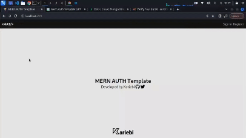

# MERN Auth Template
<h4>Created by Kariebi</h4>

**Star this Repo⭐**

A MERN (MongoDB, Express.js, React, Node.js) authentication template using ReactJS for the frontend. This template is designed to provide a starting point for MERN stack developers looking to implement authentication in their projects.

<div style="text-align:center" align='center'>
  
</div>

## Features

- **Vite-React for Frontend**: The frontend is built using Vite, a fast development server and build tool for modern web development.
- **Tailwind CSS for Styling**: The UI of this app also implemented TailwindCSS, for easy and easily adjustable styling.
- **Fortawesome icons**: This template also uses icons gotten from the Fortawesome library.
- **Express.js for Backend API**: The backend API is powered by Express.js, a minimal and flexible Node.js web application framework.
- **NodeMailer in Express for Emailing Users**: Used Nodemailer for emailing users their one-time passwords for email verification and password recovery.
- **MongoDB for Database**: MongoDB is used as the database to store user authentication information.
- **Authentication Middleware**: The template includes middleware for user authentication, making it easy to secure routes.
- **JWT (JSON Web Tokens) for Authentication**: JSON Web Tokens are used for secure authentication between the frontend and backend.
- **Google OAuth**: Integration with Google OAuth for seamless registration and login.
- **Customizable**: Easily customizable to fit your project's specific requirements.

**Star this ⭐:**
- I will be adding Google-OAuth so users can Register/signup and Signin/login directly with a click of a button and maybe Github-OAuth. Plus, I will also be refining it depending on the feedback given, so please star it to keep it on the watch.

## Getting Started

### Prerequisites

- Node.js installed on your machine.
- MongoDB installed locally or accessible remotely.

### Installation

1. Clone the repository:

    ```bash
    git clone https://github.com/kariebi/mern-auth-template.git
    ```

2. Navigate to the project directory:

    ```bash
    cd mern-auth-template
    ```

3. Install dependencies:

    ```bash
    npm install
    ```

### Configuration

1. Create a `.env` file in the backend folder of the project:

    ```env
    # MongoDB Connection URI
    MONGODB_URI='link to your MongoDB URL'

    # JWT Secret Keys
    ACCESS_TOKEN_SECRET='myaccess'secretkey' *12 to 24 random characters
    REFRESH_TOKEN_SECRET='myrefresh'secretkey' *12 to 24 random characters

    # EMAIL details
    SENDER_EMAIL='your-email@gmail.com'
    APP_PASSWORD='your-app-password'
    ```

    Update the `MONGODB_URI` with your MongoDB connection URI. For `SENDER_EMAIL` and `APP_PASSWORD`, use your Gmail address and the app password generated following the steps below.

2. Create a `.env` file in the frontend folder of the project:

    ```env
    VITE_API_URL='http://localhost:3500/'
    ```

3. Update your backend `.env` file with Google OAuth details:

    ```env
    GOOGLE_CLIENT_ID='your-google-client-id'
    GOOGLE_CLIENT_SECRET='your-google-client-secret'
    GOOGLE_REDIRECT_URI='http://localhost:3500/auth/google/callback'
    ```

    Obtain these details by setting up a project in the [Google Developer Console](https://console.developers.google.com/) and configuring the OAuth consent screen.

### Obtaining Gmail App Password

If you are using Gmail for sending emails in your application, you'll need to generate an "App Password" for secure authentication. Follow these steps:

1. Go to your Google Account settings: [https://myaccount.google.com/](https://myaccount.google.com/)

2. In the left navigation panel, click on "Security."

3. Scroll down to the "Signing in to Google" section and enable "2-Step Verification."

4. Once 2-Step Verification is enabled, scroll down to the "App passwords" section.

5. Click on "App passwords" and sign in again.

6. Select "Mail" as the app and "Other (Custom name)" for the device.

7. Enter a custom name for your app (e.g., "MERN Auth Template").

8. Click "Generate."

9. Copy the generated app password. This is the value you'll use for the `APP_PASSWORD` in your backend `.env` file.

### Running the Application

1. Start the backend server (Express API):

    ```bash
    npm run server
    ```

    The backend will be running on `http://localhost:3500`.

2. Start the frontend (React):

    ```bash
    npm run dev
    ```

    The frontend will be running on `http://localhost:5173`.

3. Visit `http://localhost:5173` in your browser to see the application.

## Usage

- The template provides a basic authentication setup with a login and registration system.
- Users can register and verify their emails with a time-based OTP.
- Users can log in normally but can only use the dashboard page after their emails have been verified.

## Star this ⭐